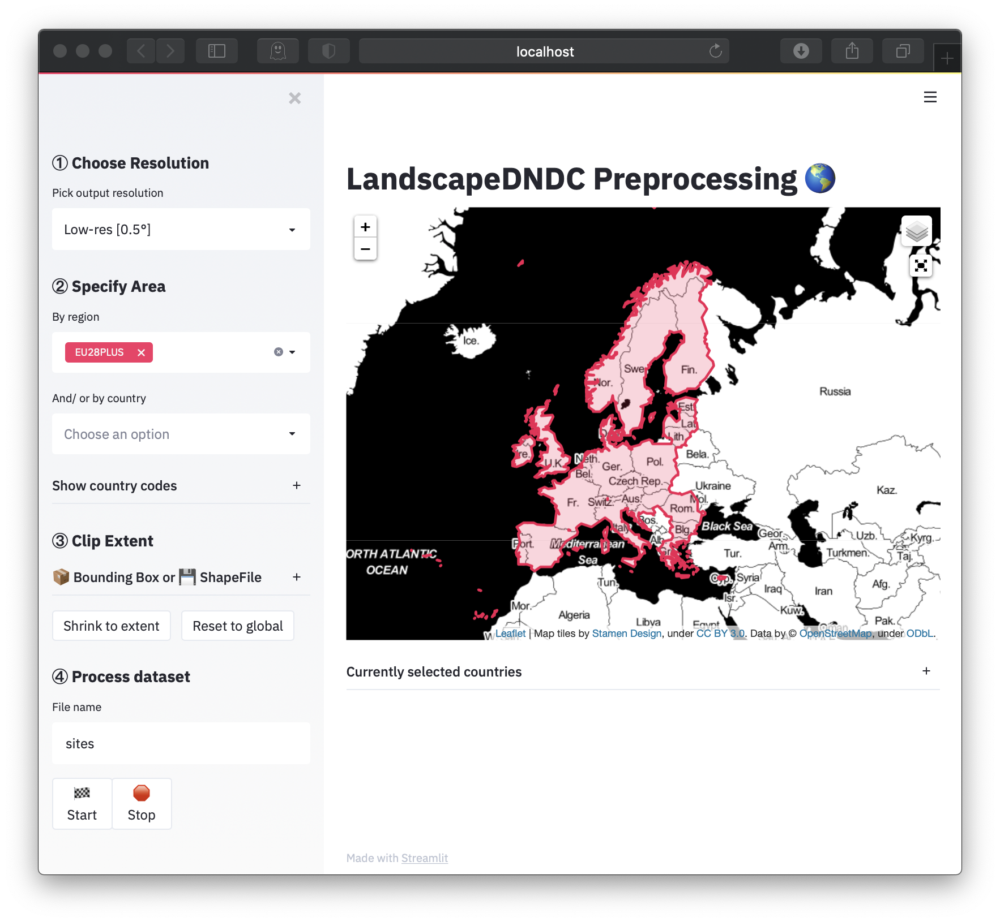

# LandscapeDNDC preprocessing tools

A set of site and climate preprocessing tools for the LandscapeDNDC model.

Tools:
- DLSC_v01.py [D]ynamic [L]andscapeDNDC [S]itefile [C]reator
- NLCC_v01.py [N]etCDF [L]andscapeDNDC [C]limate [C]onverter

Sample files for climate data (source: Sheffield et al., Princeton, USA) and
soil data (ISRIC-WISE, NL) are included.

[Christian Werner](mailto:christian.werner@kit.edu)
IMK-IFU, Karlsruhe Institute of Technology
2019/10/13

